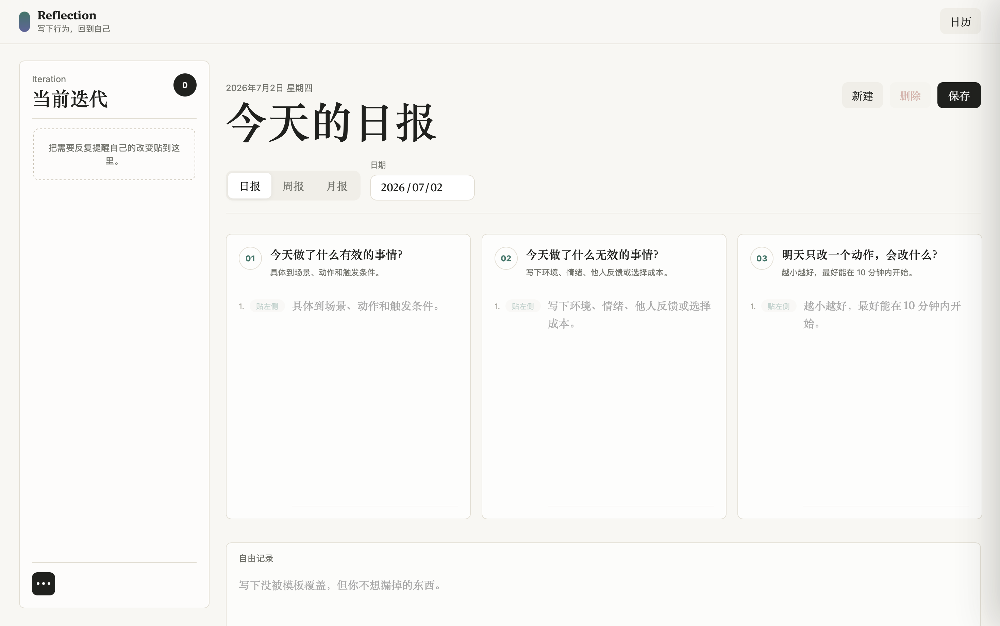
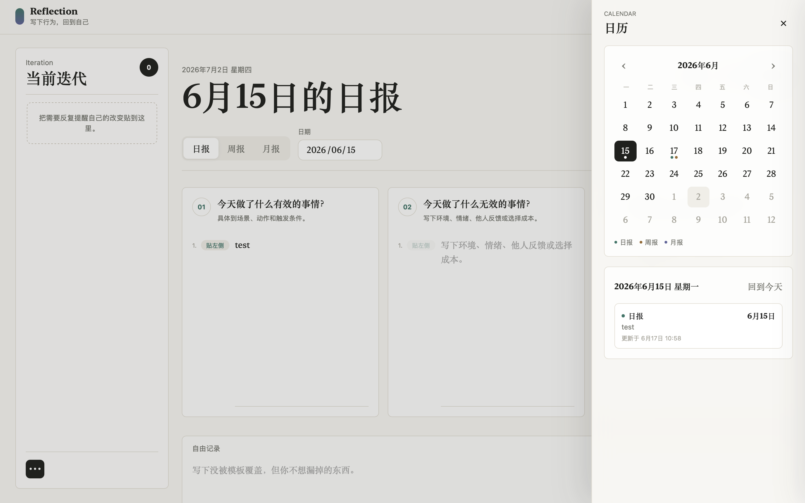
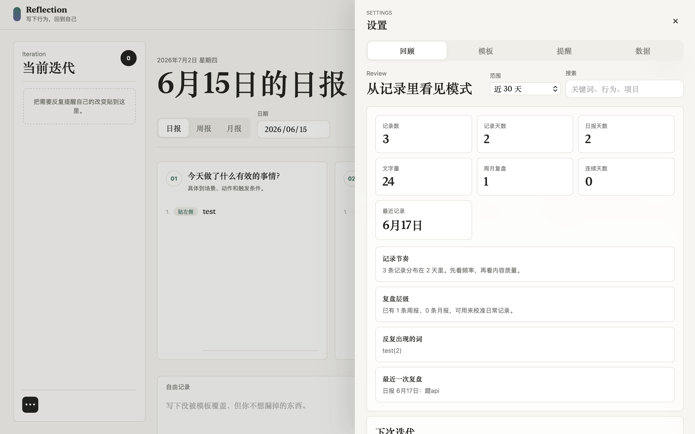
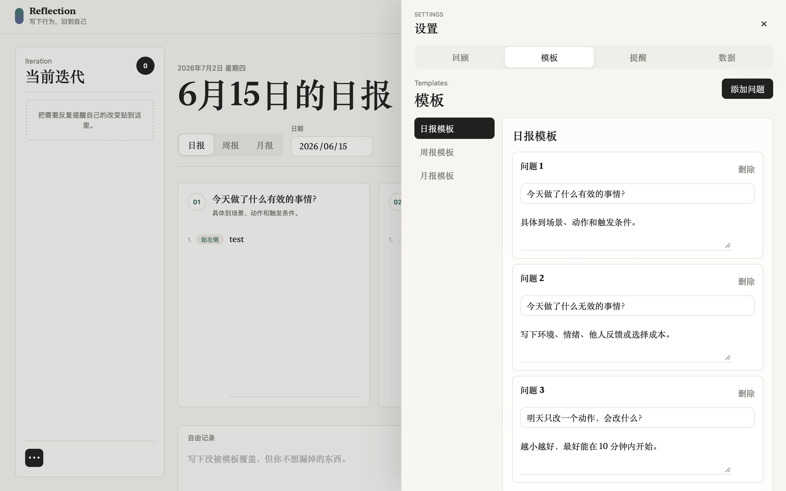
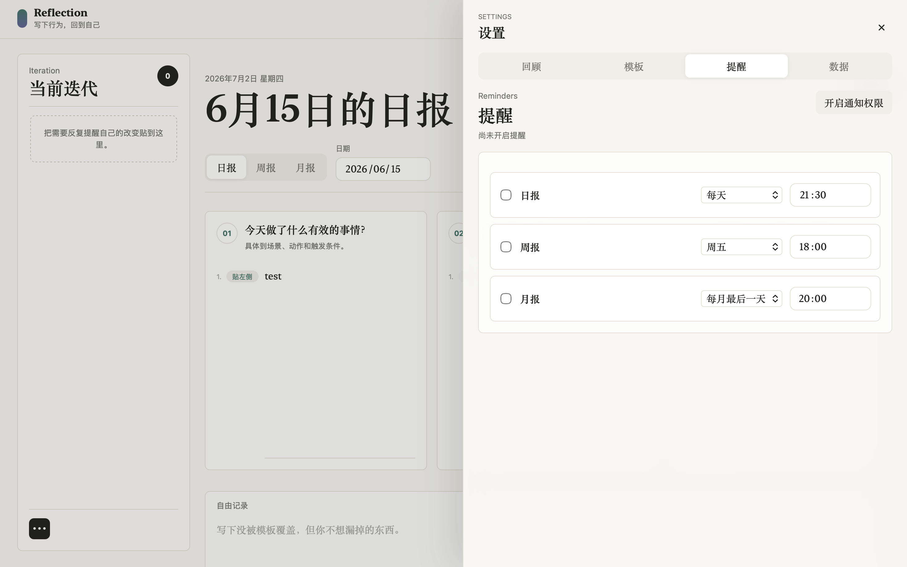
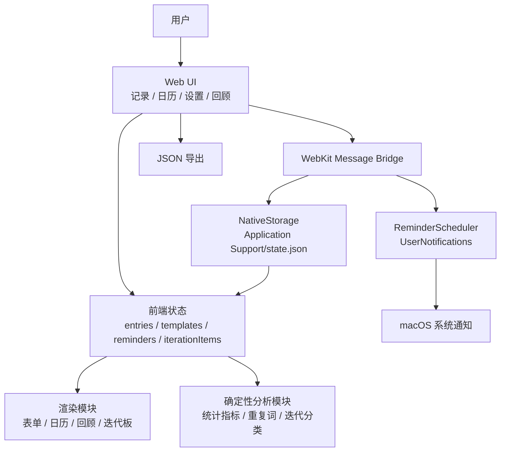

# Reflection Helper

> 一个面向个人复盘场景的 macOS 本地桌面工具，通过日报 / 周报 / 月报模板、迭代提醒、日历回看和本地通知，帮助用户把零散记录沉淀为可持续改进的行动线索。

## 项目展示

### 1. 主记录页：把反思转成下一步行动

主记录页是用户最高频使用的工作区。页面左侧固定展示“当前迭代”，中间围绕日报、周报、月报展开模板化记录，用户可以把回答里的具体行动直接贴到左侧，避免反思内容写完后沉没在长文本里。



### 2. 日历抽屉：按日期回看复盘材料

日历抽屉用于回看历史记录。用户可以按月份浏览不同日期的记录分布，并通过日报、周报、月报标记快速判断某一天有哪些复盘材料，减少在长列表中翻找历史记录的成本。



### 3. 回顾面板：从记录中提取可观察信号

回顾面板把记录重新整理成可观察的信号。它会基于本地数据统计记录数、记录天数、文字量、周月复盘数量、连续天数和重复词，并把当前迭代项放回“继续 / 调整 / 尝试”的结构中，帮助用户从材料中发现行为模式。



### 4. 模板设置：让复盘问题适应当前阶段

模板设置支持用户分别维护日报、周报和月报问题。项目没有把复盘问题写死在代码里，而是允许用户根据当前阶段调整问题和提示，让工具适应个人目标变化。



### 5. 提醒设置：用本地通知维持复盘节奏

提醒设置用于维持复盘节奏。用户可以分别配置日报、周报、月报提醒时间；在 macOS 应用中，这些配置会同步到系统本地通知，不依赖页面一直打开。



## 项目背景

很多复盘工具停留在“写日记”或“打卡”的层面，用户写完之后很难回到历史记录里发现行为模式，也很难把一次反思转化成下一次真实可执行的改变。对于需要长期自我管理的人来说，问题不只是“有没有记录”，而是：

- 记录入口是否足够低成本，能不能在每天结束时快速写下关键行为；
- 日报、周报、月报之间是否有层级关系，能不能从短期记录沉淀长期模式；
- 反思得到的下一步行动，是否能持续出现在用户面前，而不是被写完就遗忘；
- 数据是否可以保存在本机，避免个人记录依赖外部服务。

Reflection Helper 围绕“写下行为，回到自己”设计，核心目标是把个人复盘从一次性文本输入，变成“记录 -> 提炼 -> 提醒 -> 回看 -> 再迭代”的闭环。项目没有把复杂度堆到后端或 AI 上，而是优先实现可解释、可离线、可验证的本地复盘工作流。

## 核心功能

| 功能 | 解决的问题 |
| --- | --- |
| 日报 / 周报 / 月报三层记录 | 将日常行为、周期总结和月度方向分层管理，避免所有记录混在同一条时间线里。 |
| 可编辑复盘模板 | 不同阶段的复盘问题可以动态调整，减少固定模板不适配个人目标的问题。 |
| 横向问题卡片与逐行操作 | 每个模板问题独立成卡片，回答按行拆分，可将具体行动直接贴到当前迭代板。 |
| 当前迭代板 | 把“继续 / 调整 / 尝试”的行动项固定在主界面左侧，降低写完就忘的概率。 |
| 日历回看 | 按日期查看记录，并用标记区分日报、周报、月报，帮助用户快速定位历史材料。 |
| 回顾与洞察 | 基于本地记录统计记录数、记录天数、连续天数、重复词和最近记录，提供可解释的复盘信号。 |
| 本地提醒 | 支持日报、周报、月报提醒配置；macOS 应用通过系统本地通知提醒用户复盘。 |
| 数据导出与本地存储 | 正式数据保存到用户本机 Application Support 目录，并支持 JSON 导出备份。 |

## 技术架构

| 层级 | 技术选型 | 职责 |
| --- | --- | --- |
| 前端界面 | HTML + CSS + Vanilla JavaScript | 实现记录编辑、日历抽屉、设置抽屉、模板编辑、提醒配置和回顾面板。 |
| 状态管理 | 原生 JavaScript 对象 + 显式渲染函数 | 维护 entries、templates、reminders、iterationItems 等核心状态，所有 UI 从同一份状态渲染。 |
| 本地持久化 | macOS Application Support 下的 `state.json` | 正式使用时将用户记录、模板、提醒和迭代项保存到本机 JSON 文件。 |
| 原生容器 | Swift + WebKit | 将静态 Web 应用包进 macOS 桌面应用，并注入原生存储桥接脚本。 |
| 系统通知 | UserNotifications | 将 Web 侧配置的提醒同步为 macOS 本地通知。 |
| 测试 | Node.js + `vm` + 自定义 Fake DOM | 在不引入浏览器测试框架的情况下，对核心交互、存储迁移、日历标记和迭代项逻辑做冒烟测试。 |
| AI / Agent | 当前未引入 | 复盘统计、关键词提取、迭代分类均采用确定性规则，保证结果可解释、可离线运行。 |
| 后端 / 数据库 | 当前无独立后端和远程数据库 | 项目定位为本地优先工具，降低部署和隐私成本；后续可扩展同步服务。 |
| 部署 / 打包 | Bash 构建脚本 + `swiftc` | 一键复制 Web 资源、编译 Swift 壳并生成 `.app`。 |

## 架构图



## 核心流程

1. 用户选择记录类型和日期，进入日报、周报或月报的模板化输入界面。
2. 前端根据当前记录类型读取对应模板，并渲染横向问题卡片和自由记录区。
3. 用户填写回答后点击保存，应用生成以 `type-date` 为主键的记录，并写入统一状态。
4. 正式 macOS 应用中，前端通过 WebKit message handler 将状态序列化为 JSON，Swift 侧校验 JSON 后原子写入 `Application Support/Reflection Helper/state.json`。
5. 日历、当天记录列表、统计指标、重复词、当前迭代板会基于同一份状态重新渲染，保证用户看到的是保存后的结果。
6. 用户可以将回答中的某一行“贴到左侧”，系统根据问题标题和文本关键词归类为“继续 / 调整 / 尝试”，形成当前迭代项。
7. 在设置中配置提醒后，前端计算下一次提醒时间，并同步给 Swift 侧注册 macOS 本地通知。
8. 用户可以在回顾面板按时间范围和关键词筛选记录，将历史记录重新转化为下一轮行动。

## 项目结构

```text
.
├── index.html                         # 应用入口与主要 DOM 结构，包含记录区、日历抽屉、设置抽屉
├── styles.css                         # 全局样式、响应式布局、记录卡片、抽屉、日历和设置面板样式
├── app.js                             # 前端核心逻辑：状态管理、记录保存、模板、提醒、回顾、导出
├── mac/
│   ├── ReflectionHelperLauncher.swift # macOS 原生壳：WebKit 容器、本地 JSON 存储、系统通知桥接
│   ├── Info.plist                     # macOS 应用基础配置
│   ├── AppIcon.icns                   # 应用图标资源
│   └── AppIcon.iconset/               # 图标源文件集合
├── scripts/
│   ├── build-mac.sh                   # 构建 macOS .app，编译 Swift 并复制 Web 资源
│   └── generate-icon.py               # 生成应用图标的辅助脚本
├── tests/
│   └── app-smoke-test.mjs             # 冒烟测试：核心交互、存储迁移、日历和迭代项逻辑
└── build/
    └── Reflection Helper.app/         # 构建产物，通常不作为源码重点阅读
```

## 快速开始

### 1. 克隆项目

```bash
git clone <your-repo-url>
cd reflection-helper
```

### 2. 安装依赖

当前项目无 npm / pip 生产依赖。运行测试需要本机安装 Node.js；构建 macOS 应用需要 macOS 和 Xcode Command Line Tools。

```bash
xcode-select --install
```

### 3. 配置环境变量

当前版本不需要环境变量。项目没有远程后端、数据库或模型 API Key。

如后续接入同步服务或 AI 摘要，可新增 `.env.example`，但不要提交真实密钥。

### 4. 浏览器预览

```bash
open index.html
```

浏览器预览主要用于检查界面。当前正式持久化依赖 macOS 原生壳，浏览器直接打开时不会写入正式数据文件。

### 5. 构建并启动 macOS 应用

```bash
bash scripts/build-mac.sh
open "build/Reflection Helper.app"
```

正式应用数据会写入：

```text
~/Library/Application Support/Reflection Helper/state.json
```

### 6. 运行测试

```bash
node tests/app-smoke-test.mjs
```

预期输出：

```text
app smoke test passed
```

## 后续规划

- 增加本地备份与恢复：支持从 JSON 导入历史数据，并处理版本迁移和冲突提示。
- 增加趋势可视化：基于记录频率、关键词变化、迭代项完成情况展示长期行为变化。
- 增加菜单栏驻留与开机启动：让提醒和快速记录更符合桌面工具使用习惯。
- 增加可选加密存储：对本地 `state.json` 做密码保护或系统钥匙串集成，提升隐私保护。
- 探索本地或可选 AI 摘要：在用户明确开启的前提下，对周报 / 月报做摘要，但保留原文和可解释的降级路径。

## License

MIT
